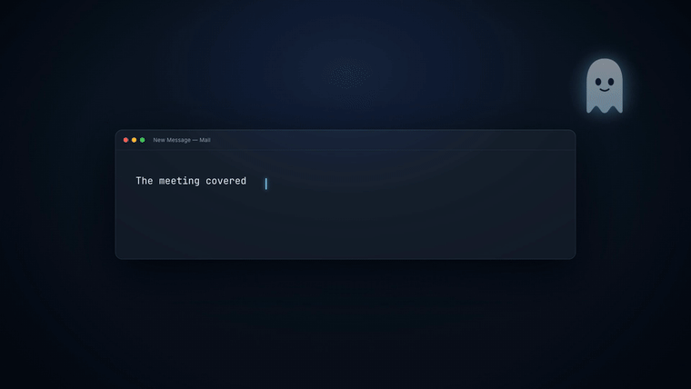

<p align="center">
  
</p>

English · [日本語](docs/i18n/README.ja.md) · [简体中文](docs/i18n/README.zh-CN.md) · [繁體中文](docs/i18n/README.zh-TW.md) · [한국어](docs/i18n/README.ko.md) · [Español](docs/i18n/README.es.md) · [Français](docs/i18n/README.fr.md) · [Deutsch](docs/i18n/README.de.md) · [Português](docs/i18n/README.pt-BR.md)

# GhostType

**Tab-to-complete autocomplete for every text field on your Mac, running entirely on your own machine.**

<p align="center">
  
  
  
  
</p>

<p align="center">
  
</p>

GhostType is a free, MIT-licensed alternative to [Cotypist](https://cotypist.app/), the closed-source Mac autocomplete app.

## The situation

You are three sentences into a reply in Gmail. You know how the sentence ends. You still have to type all of it.

Your editor solved this years ago: GitHub Copilot shows you the rest of the line in grey, and you press Tab. Nothing does that for Mail, Slack, Notes, or the browser text box you actually spend your day in.

## What GhostType does

You pause typing. Grey text appears at your cursor. Press `Tab`.

```
Before:  Thanks for sending over the draft. I read through it this morning and I think▌

After:   Thanks for sending over the draft. I read through it this morning and I think
         it's great. I'm going to start working on it today.▌
                    └─ grey ghost text, Tab to accept, Esc to dismiss
```

That is a real completion from a bundled model. It works the same way in Safari, Notes, Mail, Slack, and any other macOS text field.

<p align="center">
  
  <br>
  <em>Drafting a reply in Gmail</em>
</p>

<p align="center">
  
  <br>
  <em>Composing a post on X</em>
</p>

## Two ways to run it

This is the part most local-AI Mac apps get wrong. They bundle a model, and if you already run one, you now have two copies of the same weights sitting in memory. GhostType lets you pick.

| | Built-in | External server |
|---|---|---|
| **Setup** | Download a model in Settings. Nothing else to install. | Point GhostType at a server you already run. |
| **Runs** | `llama-server`, bundled inside the app | LM Studio, Ollama, llama.cpp, vLLM, LocalAI |
| **Model in memory** | One copy, loaded by GhostType | Zero extra. Reuses what is already loaded. |
| **Best for** | "I just want it to work." | "I already have a 32B model running, use that." |

Both paths end at the same OpenAI-compatible HTTP endpoint, so they are not two different products bolted together. The only difference is who owns the server process.

If your external server happens to be `llama-server`, GhostType detects that automatically and uses the same high-quality completion path as the built-in backend. See [Completion quality](#completion-quality) for what that means.

## Install

Download the latest `.dmg` from the [Releases](https://github.com/mk668a/GhostType/releases) page, open it, and drag **GhostType** into **Applications**.

### Approving it on first launch

GhostType is not notarized. Notarization requires a paid Apple Developer account, which this project does not have, so macOS blocks the first launch and asks you to approve the app by hand. It is a one-time step.

1. Open **GhostType**. macOS refuses, saying it cannot verify the developer.
2. Open **System Settings > Privacy & Security** and scroll down to **Security**.
3. Next to the message about GhostType being blocked, click **Open Anyway**, then **Open** to confirm.

> On macOS 15 Sequoia and later, Control-clicking the app and choosing **Open** does not work. Apple removed that shortcut, so System Settings is the only route.

Updates that GhostType installs for itself later do not repeat this. The check applies to the first launch of a downloaded app, not to one updating in place.

To skip the whole thing, [build it yourself](#build-from-source). An app you compiled was never downloaded, so it carries no quarantine flag and launches with no prompt at all.

## Setup

### Step 1: Choose a backend

The setup guide opens on first launch. Pick **Built-in** and download a model, or pick **External server** and enter its endpoint.

Built-in models. The prose models are base models rather than instruction-tuned chat models, because a chat model asked to finish a sentence tends to answer it instead:

| Model | Size | For | Notes |
|-------|------|-----|-------|
| Qwen3.5 0.8B Base | ~0.6 GB | Prose | Fastest. Fine on 8 GB Macs. |
| Qwen3.5 2B Base | ~1.3 GB | Prose | Recommended. Best latency-to-quality balance. |
| Qwen3.5 4B Base | ~2.7 GB | Prose | Highest quality. Wants 16 GB or more. |
| Qwen2.5-Coder 0.5B | ~0.5 GB | Code | Lightweight, for code and technical writing. |
| Qwen2.5-Coder 1.5B | ~1.6 GB | Code | Stronger on code, weaker on everyday prose. |

Models download to `~/Library/Application Support/GhostType/models` and never leave your Mac.

### Step 2: Grant two permissions

GhostType needs both:

- **Input Monitoring** to notice that you paused typing
- **Accessibility** to read the text around your cursor and insert what you accept

Enable GhostType under **System Settings > Privacy & Security** for each. The menu bar icon tells you which one is still missing.

### Step 3: Type something

Open TextEdit, write half a sentence, and wait. Grey text appears. Press `Tab`.

## Completion quality

Two things make the difference between a completion you accept and one you delete.

**Fill-in-the-middle.** Most autocomplete tools send the model only the text before your cursor. That model has no idea a sentence already continues after you, so it writes a second ending on top of the one you have. GhostType sends the text on both sides using llama.cpp's `/infill` endpoint, so a completion lands *inside* your sentence instead of duplicating its tail.

**Constrained generation.** A model asked to complete a sentence will sometimes answer with a code fence, a quoted restatement, or three paragraphs of explanation. Cleaning that up afterwards is guesswork. Instead, GhostType compiles a GBNF grammar and hands it to the sampler, which makes those tokens unreachable in the first place. The model never spends time generating text that was going to be thrown away.

| Setting | Grammar | Use when |
|---------|---------|----------|
| Single line | Blocks newlines and leading code fences | Email, chat, browser fields (default) |
| Up to a few lines | Allows up to 4 lines | Editors, notes, multi-line boxes |
| Unconstrained | None | A model misbehaves under constraints |

Both features need a server that speaks llama.cpp's API. That is always true for the built-in backend, and true for an external `llama-server`. Against a plain OpenAI-compatible server, GhostType falls back to chat completions with a cursor marker, which still works but is noticeably blunter.

## Keyboard shortcuts

| Key | Action |
|-----|--------|
| `Tab` | Accept completion |
| `Esc` | Dismiss completion |
| `Cmd + Option + \` | Manually trigger a completion |
| `Cmd + Shift + G` | Toggle GhostType on and off |

All shortcuts are customizable in Settings.

## App compatibility

| App type | Auto-trigger | Why |
|----------|-------------|-----|
| TextEdit, Notes, Pages | Yes | Full Accessibility API support |
| Safari, Chrome web inputs | Yes | Falls back to the keystroke buffer |
| Mail, Slack, Discord | Manual only | Auto-trigger fights their own input handling |
| IDEs, terminals | Disabled | They already have completions |

Auto-trigger also pauses while a non-ASCII input method (Japanese, Chinese, Korean) is composing, so it never interferes mid-conversion.

## What it does not do

- No cloud inference. There is no API key field, because there is no API to key into.
- No telemetry, no analytics, no input logging.
- No account, no subscription, no usage limit.
- It does not rewrite, translate, or restructure your text. It finishes the sentence you started.

## System requirements

| | Minimum | Recommended |
|--|---------|-------------|
| **macOS** | 14.0 Sonoma | 15.0 Sequoia |
| **Chip** | Apple M1 | Apple M2 Pro or better |
| **Memory** | 8 GB | 16 GB or more |
| **Storage** | 1 GB plus the model | 5 GB |

## Privacy

Every completion is generated on your Mac. The built-in backend talks to a `llama-server` process on `127.0.0.1`; the external backend talks to whatever loopback address you configured. GhostType makes no other network requests except checking for its own updates.

## Troubleshooting

**The switch is on in System Settings, but GhostType says the permission is missing.**
This one hits everyone who updated from 0.3.1 or earlier. macOS ties each Accessibility grant to the code signature of the app that received it, and every release up to 0.3.1 was signed with a hash of the build itself, which changed every version. 1.0.0 uses a stable certificate instead, so it stops here, but your Mac still has the old rule stored. Toggling the switch updates the permission without rewriting the rule attached to it, so the app keeps being denied while the switch reads as on.

Turning the switch off and on will not clear it, and neither will removing GhostType from the list with the minus button. The stored entry has to be deleted:

```bash
sudo tccutil reset Accessibility com.ghosttype.app
sudo tccutil reset ListenEvent com.ghosttype.app
sudo killall tccd
```

Then relaunch GhostType and approve it when it asks. Once is enough. To confirm which case you are in, look for `Failed to match existing code requirement` here:

```bash
log show --last 5m --predicate 'process == "tccd"' | grep -i ghosttype
```

**Completions do not appear in other apps.**
Check the menu bar status. If it says "Grant Accessibility" or "Grant Input Monitoring", open the matching pane in System Settings and toggle GhostType on. It restarts itself within a few seconds. Building from source re-signs the app, and if you build without a signing identity the signature changes every time, so macOS asks for Accessibility again after each build. Run `scripts/make-signing-cert.sh` once and build with `GHOSTTYPE_SIGN_IDENTITY` set to keep the permission across rebuilds.

**They work in the Settings test field but nowhere else.**
That is Accessibility permission specifically. The test field is inside GhostType, so it needs no system permission.

**Status says "Ready" but no ghost text appears.**
Confirm a model is downloaded (built-in) or the server is running (external). Try the manual shortcut. Check whether the app is on the Excluded Apps list.

**The built-in backend says the llama.cpp binaries are missing.**
You are running a build made without them. Run `scripts/fetch-llama.sh` and rebuild, or switch to an external server.

## Build from source

```bash
git clone https://github.com/mk668a/GhostType.git
cd GhostType
open GhostType.xcodeproj
```

The build fetches the pinned llama.cpp release binaries on its first run and stages them into the app bundle, so there is no separate setup step. To fetch them by hand, or to build for Intel:

```bash
./scripts/fetch-llama.sh                 # host architecture
LLAMA_ARCH=x64 ./scripts/fetch-llama.sh  # Intel
GHOSTTYPE_SKIP_LLAMA=1 xcodebuild ...    # skip, external backend only
```

Other scripts:

```bash
./scripts/create-dmg.sh   # build the DMG installer
./scripts/install.sh      # build and install into /Applications
```

Requires Xcode and the Command Line Tools (`xcode-select --install`).

## Architecture

```
GhostType/
├── App/
│   ├── GhostTypeApp.swift          # Entry point, AppSettings, backend enum
│   ├── AppDelegate.swift           # Menu bar, lifecycle, server teardown
│   ├── SettingsView.swift          # Preferences and setup guide
│   └── MenuBarView.swift           # Status menu
├── Core/
│   ├── AccessibilityManager.swift  # AX text read/write, permissions
│   ├── GlobalKeyMonitor.swift      # CGEventTap keystroke monitoring
│   ├── InputSourceMonitor.swift    # IME state, pauses auto-trigger
│   ├── CompletionController.swift  # Debounce, ghost text lifecycle
│   └── CompletionEngine.swift      # Backend selection, circuit breaker
├── LLM/
│   ├── LLMProvider.swift           # HTTP client, /infill and chat paths
│   ├── BundledLlamaServer.swift    # Supervises the bundled llama-server
│   ├── ModelCatalog.swift          # Downloadable models, on-disk layout
│   ├── ModelDownloader.swift       # Resumable downloads with progress
│   └── CompletionGrammar.swift     # GBNF construction
└── UI/
    ├── OverlayWindow.swift         # Ghost text overlay window
    └── CompletionPopup.swift       # Multi-suggestion popup
```

## Credits

Inference runs on [llama.cpp](https://github.com/ggml-org/llama.cpp) (MIT). The prose models are [mradermacher](https://huggingface.co/mradermacher) GGUF conversions of Qwen3.5 Base, and the code models are the [ggml-org](https://huggingface.co/ggml-org) conversions of [Qwen2.5-Coder](https://github.com/QwenLM/Qwen2.5-Coder). Both model families are Apache-2.0.

## License

[MIT](LICENSE). Use it, fork it, ship it commercially. No strings attached.

---

**GhostType** *Type less. Think more.*
