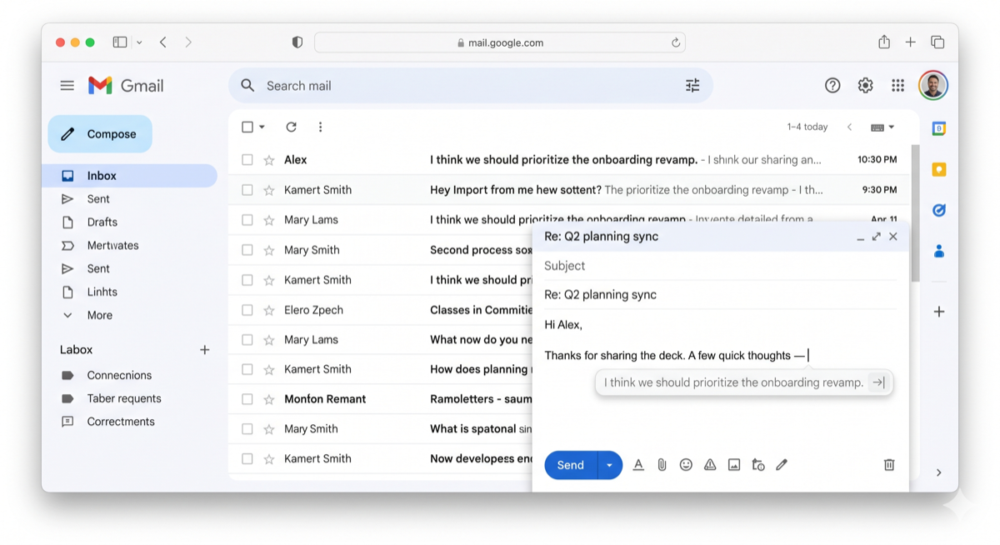
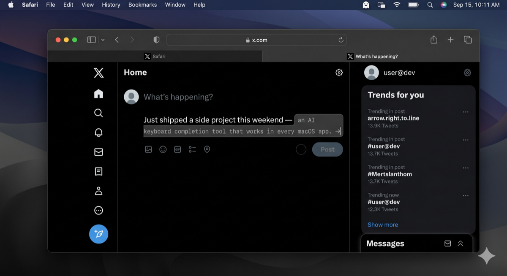

<p align="center">
  
</p>

# GhostType

**macOS 向け AI キーボード補完エンジン**

GhostType は GitHub Copilot 風のゴーストテキスト補完を **macOS のすべてのアプリ** にもたらします。テキストエディタ、ブラウザ、メールクライアントなど、どこでも動作します。ローカル LLM を活用しているため、文脈に応じた補完を提供しながらデータを完全にプライベートに保ちます。

<p align="center">
  
  
  
  
</p>

[English README](../../README.md)

## 特長

- **システム全体での補完** -- macOS の任意のテキストフィールド (Safari、メモ、メールなど) で動作
- **ゴーストテキスト UI** -- 提案がカーソル付近に半透明のオーバーレイテキストとして表示
- **完全ローカル** -- すべての推論は端末上で実行。データが Mac の外に出ることは一切ありません
- **OpenAI 互換サーバーに対応** -- LM Studio、Ollama、llama.cpp、vLLM など
- **低レイテンシ** -- Apple Silicon に最適化された高速応答

## 実際の動作

ゴーストテキスト補完は、入力中の場所にそのまま表示されます — あらゆるアプリで。

<p align="center">
  
  <br>
  <em>Gmail で返信を作成中</em>
</p>

<p align="center">
  
  <br>
  <em>X で投稿を作成中</em>
</p>

## インストール

### ダウンロード

[Releases](https://github.com/mk668a/GhostType/releases) ページから最新の **GhostType-0.2.0.dmg** をダウンロードしてください。

### インストール手順

1. ダウンロードした `.dmg` ファイルを開く
2. **GhostType** を **アプリケーション** フォルダにドラッグ
3. アプリケーション (または Spotlight) から GhostType を起動
4. 初回起動時に表示されるセットアップガイドに従う

> **注意:** macOS は初回起動時に「開発元を確認できません」と警告することがあります。
> アプリを右クリックして **開く** を選択するか、**システム設定 > プライバシーとセキュリティ** で **このまま開く** をクリックしてください。

## セットアップ

### Step 1: ローカル LLM サーバーを起動

GhostType は Mac 上で動作するローカル LLM サーバーに接続します。いずれかを選んでください。

**[LM Studio](https://lmstudio.ai) (推奨):**
1. LM Studio をダウンロードしてインストール
2. モデルを検索してダウンロード (例: `Qwen2.5-Coder-3B`)
3. 「Start Server」をクリック (`http://127.0.0.1:1234` で起動)

**[Ollama](https://ollama.com):**
1. Ollama をダウンロードしてインストール
2. ターミナルを開いて実行:
   ```
   ollama pull qwen2.5-coder:3b
   ```
3. Ollama は `http://127.0.0.1:11434` で自動的に起動します

### Step 2: 必要な権限を許可

GhostType は以下の両方の権限を必要とします。

- **入力監視**: `NSEvent.addGlobalMonitorForEvents` でキー入力を検出
- **アクセシビリティ**: AX API で周辺テキストの読み取りと補完の挿入を行う

以下から GhostType を有効化してください。

- **システム設定 > プライバシーとセキュリティ > 入力監視**
- **システム設定 > プライバシーとセキュリティ > アクセシビリティ**

> セットアップが完了するまで、メニューバーアイコンに「入力監視を許可」や「アクセシビリティを許可」と表示されることがあります。

### Step 3: GhostType を設定

1. メニューバーの GhostType アイコンをクリック
2. **設定** を開く
3. サーバーエンドポイントを入力 (例: `http://127.0.0.1:1234`)
4. **接続テスト** をクリックして検証

## 動作の仕組み

```
入力中:    "今日の会議では"
           (タイプを止める)
GhostType: "今日の会議では四半期売上目標と製品ロードマップが議論された"
                          ^^^^^^^^^^^^^^^^^^^^^^^^^^^^^^^^^^^^^^^^^^^^^
                          ゴーストテキストが表示 -- Tab で受け入れ
```

1. GhostType は入力監視経由でキー入力を観測
2. タイプが止まると、Accessibility API で周辺テキストを読み取る
3. テキストをローカル LLM サーバーへ送信し補完を取得
4. 提案がカーソル付近にゴーストテキストとして表示される
5. **Tab** で受け入れ、**Esc** で却下

## キーボードショートカット

| キー | アクション |
|-----|-----------|
| `Tab` | 補完を受け入れ |
| `Esc` | 補完を閉じる |
| `Option + \` | 補完を手動でトリガー |
| `Cmd + Shift + G` | GhostType のオン／オフ切替 |

すべてのショートカットは設定画面でカスタマイズ可能です。

## 対応 LLM サーバー

| アプリ | デフォルトエンドポイント | 備考 |
|--------|--------------------------|------|
| **[LM Studio](https://lmstudio.ai)** | `http://127.0.0.1:1234` | GUI、簡単なモデル管理 |
| **[Ollama](https://ollama.com)** | `http://127.0.0.1:11434` | 軽量、CLI |
| **llama.cpp** | `http://127.0.0.1:8080` | 上級者向け |
| **vLLM / LocalAI** | `http://127.0.0.1:8000` | 高スループット |

### 推奨モデル

| モデル | サイズ | 得意分野 |
|--------|--------|----------|
| Qwen2.5-Coder-3B | 約 2 GB | コード・技術文書 |
| DeepSeek-Coder-V2-Lite | 約 2 GB | FIM 特化、高品質 |
| CodeGemma-2B | 約 1.5 GB | 超軽量、低レイテンシ |

## 設定

メニューバーのアイコン > **設定** から以下を設定できます。

- **サーバー** -- エンドポイント URL とモデル名
- **推論** -- Temperature、最大トークン数、Top P
- **トリガー** -- 自動/手動トリガー、デバウンス遅延
- **外観** -- ゴーストテキストの不透明度とフォントサイズ
- **キーボードショートカット** -- すべてのキーバインドをカスタマイズ
- **除外アプリ** -- 特定のアプリで無効化 (IDE/ターミナルは既定で除外)

## アプリ互換性

GhostType は macOS のほとんどのアプリで動作します。注意点は以下のとおりです。

| アプリの種類 | 自動トリガー | 備考 |
|--------------|--------------|------|
| TextEdit、メモ、Pages | あり | Accessibility API で完全対応 |
| Safari、Chrome (Web 入力) | あり | キーストロークバッファをフォールバックとして使用 |
| メール、Slack、Discord | 手動のみ | `Option + \` でトリガー |
| IDE、ターミナル | 無効 | 独自の補完を備えているため |

## システム要件

| | 最低 | 推奨 |
|--|------|------|
| **macOS** | 14.0 Sonoma | 15.0 Sequoia |
| **CPU** | Apple M1 / Intel i7 | Apple M2 Pro+ |
| **RAM** | 8 GB | 16 GB+ |
| **ストレージ** | 5 GB (モデル含む) | 10 GB+ |

## プライバシーとセキュリティ

- 通信先は **ローカル LLM サーバーのみ** (`127.0.0.1`)。クラウドもテレメトリもなし
- 入力ログやデータ収集は一切なし
- アクセシビリティ権限は初回起動時に要求されます
- すべての補完はあなたの Mac 上の自前 LLM によって生成されます

## トラブルシューティング

**外部アプリで補完が表示されない:**
1. メニューバーのステータスを確認:
   - 「アクセシビリティを許可」と表示されている場合は、システム設定 > プライバシーとセキュリティ > アクセシビリティ で GhostType をオンに
   - 「入力監視を許可」と表示されている場合は、システム設定 > プライバシーとセキュリティ > 入力監視 で GhostType をオンに
2. 権限を許可すると、GhostType は数秒以内に自動的に再起動します
3. それでも「準備完了」にならない場合は、GhostType を終了して再起動してみてください
4. ソースからビルドする場合、ビルドごとにアクセシビリティを再付与する必要があることがあります (コード署名が変わるため)

**設定のテストフィールドでは補完が動くのに他のアプリでは動かない:**
- アクセシビリティ権限が許可されていません。テストフィールドはシステム権限を必要としない直接接続を使いますが、外部アプリでは必要です。

**ステータスが「準備完了」なのにゴーストテキストが表示されない:**
- LLM サーバーが起動しているか確認してください (設定で接続テスト)
- 手動トリガーのショートカット (`Option + \`) を試してください
- 該当アプリが除外アプリリストに含まれていないか確認してください

## アンインストール

1. メニューバーから GhostType を終了
2. アプリケーションフォルダから GhostType をゴミ箱へドラッグ
3. 必要に応じて設定を削除: `~/Library/Preferences/com.ghosttype.app.plist`

## ソースからビルド

```bash
git clone https://github.com/mk668a/GhostType.git
cd GhostType

# DMG インストーラを作成
./scripts/create-dmg.sh

# または直接インストール
./scripts/install.sh

# あるいは Xcode で開く
open GhostType.xcodeproj
```

Xcode Command Line Tools (`xcode-select --install`) が必要です。

## アーキテクチャ

```
GhostType/
├── App/
│   ├── GhostTypeApp.swift          # アプリのエントリポイント・設定
│   ├── AppDelegate.swift           # メニューバー、ライフサイクル、補完フロー
│   ├── SettingsView.swift          # 環境設定 UI
│   └── WelcomeView.swift           # 初回起動時のセットアップガイド
├── Core/
│   ├── AccessibilityManager.swift  # AX API テキスト読み書き、権限管理
│   ├── EventTapManager.swift       # NSEvent でのグローバル/ローカルキー監視
│   └── CompletionEngine.swift      # LLM 補完オーケストレーション
├── LLM/
│   └── LLMProvider.swift           # OpenAI 互換 API クライアント
└── UI/
    ├── OverlayWindow.swift         # ゴーストテキストオーバーレイウィンドウ
    └── CompletionPopup.swift       # 複数候補ポップアップ
```

## ライセンス

[PolyForm Noncommercial License 1.0.0](../../LICENSE)

GhostType は **ソース公開** ソフトウェアであり、OSI の定義に基づくオープンソースではありません。個人利用、教育、研究、非商用組織での利用は無償で許可されています。**商用利用はこのライセンスでは許可されていません** — 商用ライセンスが必要な場合はメンテナにお問い合わせください。

---

**GhostType** -- *タイプを減らし、考える時間を増やそう。*
